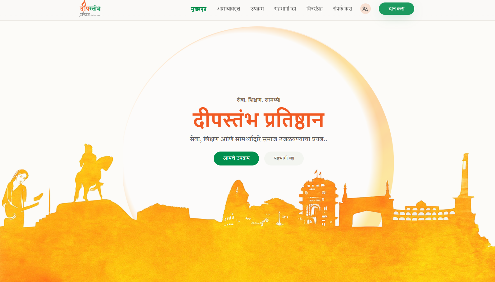
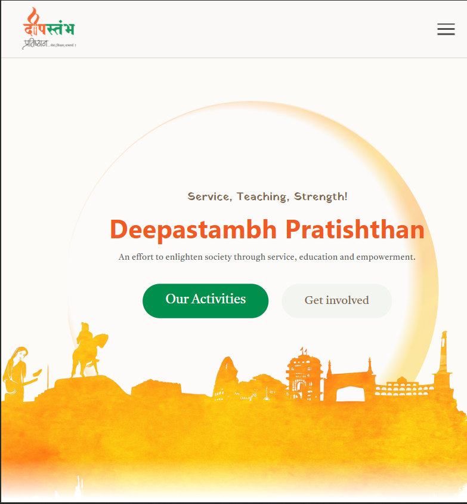
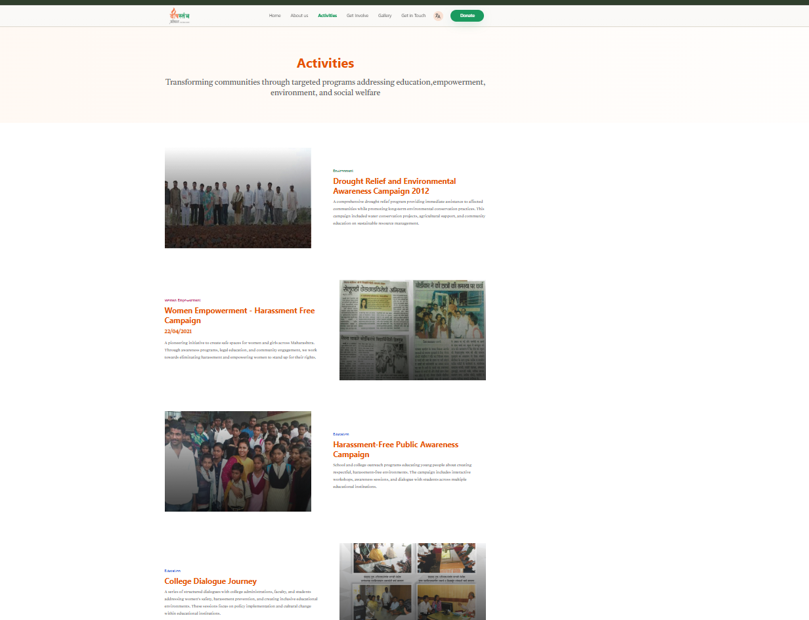
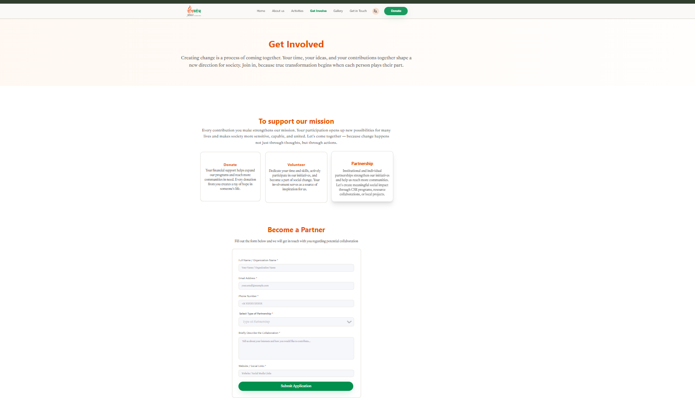

# Deepastambh Pratishthan — NGO Website

A bilingual (English / Marathi) website for Deepastambh Pratishthan, a social foundation
working across Maharashtra in service, education, and community empowerment. The site
covers the foundation's mission, activities, initiatives and success stories, a gallery,
and the donation/volunteer touchpoints.

I built this during a 5-month internship at Aivot AI, where I worked as an Associate
Software Engineer. It was my first proper end-to-end frontend project, so a lot of it was
me figuring things out as I went — the component structure, the bilingual setup, and
getting it deployed on a static host.

**Live Demo:** https://deepstambh-ngo.vercel.app

## Screenshots

The same Home page in both languages — the EN/MR toggle swaps every string, and the layout
adapts down to mobile:

| Desktop (Marathi) | Mobile (English) |
|---|---|
|  |  |

**About — the founder**


**Activities**



**Get Involved**



## What it does

- **English / Marathi toggle.** All the text runs through a small i18n layer built on React
  Context. The chosen language is saved to `localStorage`, so it sticks between visits, and
  each language file is loaded only when it's actually needed.
- **Seven pages.** Home, About, Activities, Gallery, Get Involved, Donate, and Contact, all
  wired up with React Router. The Home page also has an Initiatives & Success Stories
  section.
- **Engagement popups.** Subscribe / Volunteer / Contact prompts that show up on a timer and
  pick one at random. They're driven from a single context, so any page can trigger them.
- **Shared components.** Header, Footer, Hero, Mission, Core Focus, Initiatives, and the
  Transformation section are all broken out into their own pieces.
- **Responsive.** Built with Tailwind so it holds up on phones, tablets, and desktop.

## Tech stack

- React 19
- React Router 7 (HashRouter)
- Tailwind CSS 3 (+ PostCSS, Autoprefixer)
- Vite (rolldown-vite)
- React Context API + Hooks for state and i18n
- ESLint 9
- JavaScript (JSX)

## Project structure

```
src/
├── App.jsx                 # Routes + global providers
├── main.jsx                # App entry point
├── context/
│   ├── LanguageContext.jsx # Bilingual i18n provider (English/Marathi)
│   └── PopupContext.jsx    # Timed/randomized popup engine
├── locale/
│   ├── english.json        # English translations
│   └── marathi.json        # Marathi translations
├── components/
│   ├── Header/  Footer/  Transformation/
│   └── Popup/              # Subscribe, Volunteer, Contact popups
└── Pages/
    ├── Home/  About/  Activities/  Gallery/
    ├── Getinvolved/  Donate/  Contact/
    └── Home/components/    # Hero, Mission, CoreFocus, Initiatives
```

## Running it locally

You'll need Node.js 18+ and npm.

```bash
git clone https://github.com/som0121/Deepstambh-ngo.git
cd Deepstambh-ngo
npm install
npm run dev
```

Scripts:

- `npm run dev` — start the dev server
- `npm run build` — production build
- `npm run preview` — preview the build locally
- `npm run lint` — run ESLint

## A few things I ran into

- **Keeping the bilingual text manageable.** Rather than duplicating every string in two
  languages inside the components, I put everything behind a `t(key)` helper backed by JSON
  files. Components just call `t("hero_title")` and the language switch handles the rest.
  Only the active language's file gets imported.
- **Remembering the language choice.** The selected language is written to `localStorage` and
  read back on load, so someone coming back to the site keeps whatever they picked last time.
- **Popups that don't annoy.** The foundation wanted Subscribe/Volunteer/Contact prompts but
  nothing pushy. I kept the timers in a single `PopupContext` and used `useRef` so they get
  cleaned up properly instead of piling up.
- **Routing on a static host.** Went with `HashRouter` so deep links don't 404 on GitHub
  Pages / Netlify without needing any server config.

## Notes

This was built as part of my internship at Aivot AI for Deepastambh Pratishthan. Please reach
out before reusing it.
